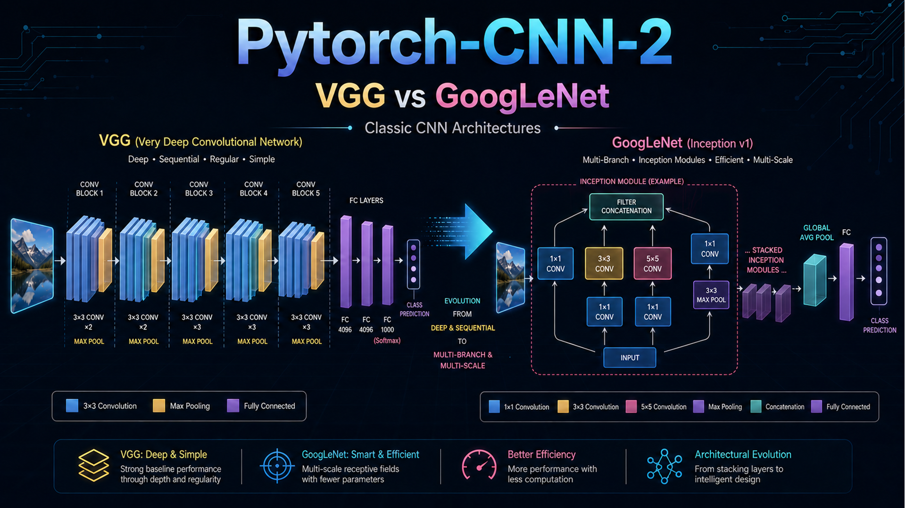
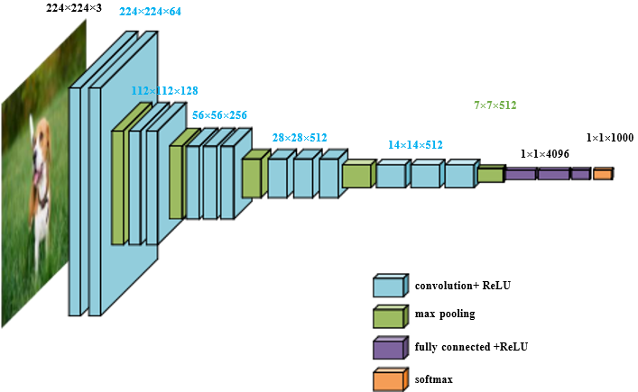
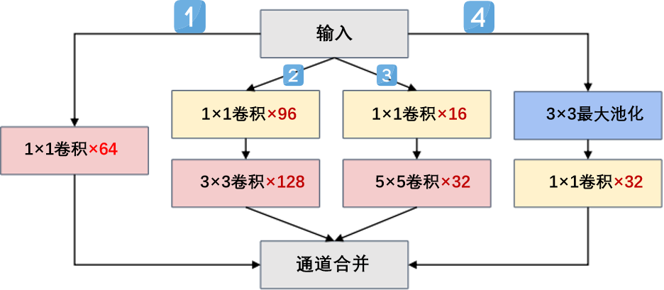
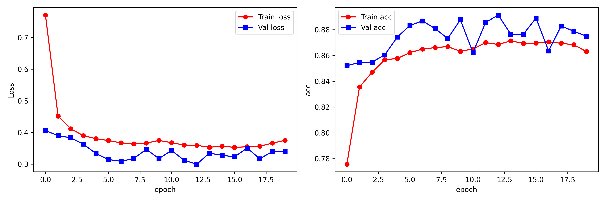
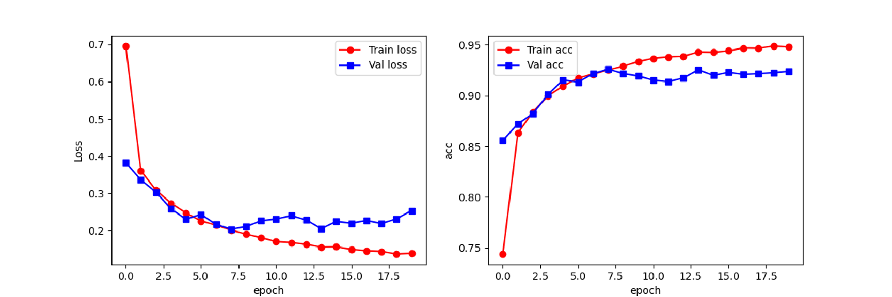
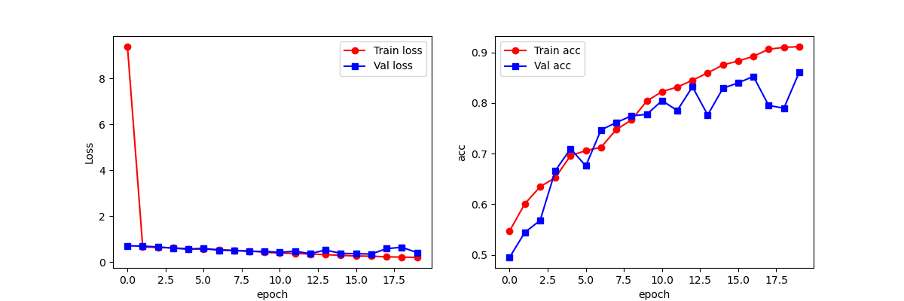
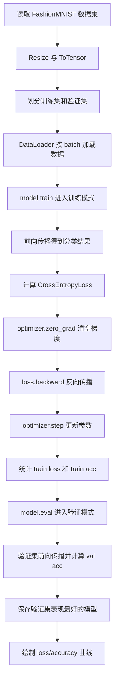

# PyTorch-CNN-2：VGG16 与 GoogLeNet 的结构复现、训练优化与数据集迁移



> **面向经典 CNN 模型的科研训练记录：从 VGG16 与 GoogLeNet 的结构理解，到 PyTorch 手动复现；从 FashionMNIST 标准数据集训练，到个人猫狗数据集迁移应用。**

---

## 🌟 项目概览

本项目围绕经典卷积神经网络 **VGG16** 与 **GoogLeNet** 展开，重点记录我在模型原理学习、网络结构复现、训练调参和数据集迁移应用中的实践过程。

相比直接调用现成模型，本项目更关注经典模型内部结构的理解与手动实现，尤其是：

- 在 `VGG16/model.py` 中理解并实现 VGG16 的 **卷积 Block 堆叠结构**；
- 在 `GoogLeNet/model.py` 中理解并实现 GoogLeNet 的 **Inception 多分支模块**；
- 在个人计算资源有限的条件下，针对 VGG16 训练速度慢、显存占用高等问题进行超参数调整，最终完成 FashionMNIST 十分类训练；
- 将 GoogLeNet 从 FashionMNIST 标准数据集进一步推广到个人猫狗图像数据集，完成二分类训练、测试集评估与单张图片预测；
- 将论文、结构图、训练结果和部分学习总结整理为 PPT，形成较完整的学习与科研训练记录。

本项目尝试通过复现经典模型，理解模型结构背后的设计思想，并在真实训练过程中锻炼问题分析、实验调参、工程组织和迁移应用能力。

---

## ⭐项目重点

本项目重点培养我以下能力：

| 重点能力 | 具体体现 |
|---|---|
| **模型结构理解能力** | 不是直接调用 torchvision 中的现成模型，而是在 `model.py` 中手动搭建 VGG16 的卷积 Block 和 GoogLeNet 的 Inception 模块 |
| **实验调试与训练优化能力** | 在 VGG16 训练过程中遇到算力和显存压力后，尝试调整 batch size、learning rate、epoch、optimizer 等，使模型能够稳定完成训练 |
| **数据集迁移应用能力** | 将 GoogLeNet 从 FashionMNIST 十分类任务推广到个人猫狗数据集二分类任务，完成数据划分、mean/std 计算、模型训练、测试和单图预测 |

---

## 📥 学习资料整理

| 资料 | 下载/查看链接 | 说明 |
|---|---|---|
| VGG 原论文 | [Download VGG Paper](<./assets/papers/〖2014〗〖VGGNet〗1409.1556v6.pdf>) | 重点理解小卷积核堆叠、网络深度增加和 VGG Block 设计 |
| GoogLeNet 原论文 | [Download GoogLeNet Paper](<./assets/papers/〖2015〗〖GoogLeNet〗Szegedy_Going_Deeper_With_2015_CVPR_paper.pdf>) | 重点理解 Inception 模块、多尺度特征提取和 1×1 卷积降维 |
| 学习 PPT | [Download Study PPT](<./assets/ppt/Pytorch框架与经典卷积神经网络与实战(二).pdf>) | 我整理的 VGG、GoogLeNet 原理与实战学习材料 |
| VGG16 模型代码 | [VGG16/model.py](./VGG16/model.py) | VGG16 网络结构定义，重点是卷积 Block 的搭建 |
| VGG16 训练代码 | [VGG16/model_train.py](./VGG16/model_train.py) | VGG16 在 FashionMNIST 上的训练与验证流程 |
| VGG16 测试代码 | [VGG16/model_test.py](./VGG16/model_test.py) | 加载 VGG16 最优模型并在测试集上评估 |
| GoogLeNet 模型代码 | [GoogLeNet/model.py](./GoogLeNet/model.py) | GoogLeNet 网络结构定义，重点是 Inception 模块 |
| GoogLeNet 训练代码 | [GoogLeNet/model_train.py](./GoogLeNet/model_train.py) | GoogLeNet 在 FashionMNIST 上的训练与验证流程 |
| GoogLeNet 测试代码 | [GoogLeNet/model_test.py](./GoogLeNet/model_test.py) | 加载 GoogLeNet 最优模型并在测试集上评估 |
| 猫狗分类项目 | [GoogLeNet-1/](./GoogLeNet-1/) | 将 GoogLeNet 推广到个人猫狗数据集二分类任务 |

> 说明：论文放在 `assets/papers/`，PPT 放在 `assets/ppt/`，图片放在 `assets/images/`，模型代码分别放在 `VGG16/`、`GoogLeNet/` 和 `GoogLeNet-1/` 目录下。

---

## 🧠 学习主线

本项目按照“理论理解 → 结构复现 → 标准数据集训练 → 个人数据集迁移”的路线展开。


这条学习主线让我逐渐认识到：

> **经典 CNN 的价值不只是最终准确率，更重要的是网络结构背后的设计思想，以及如何把这些结构真正写成可训练、可测试、可迁移的 PyTorch 代码。**

---

## 🔬 关键能力点

| 能力方向 | 本项目中的体现 |
|---|---|
| 模型结构理解 | 理解 VGG16 的卷积 Block 堆叠思想，以及 GoogLeNet 的 Inception 多分支结构 |
| PyTorch 复现 | 在 `model.py` 中手动搭建 VGG16 和 GoogLeNet，而不是直接调用现成模型 |
| 实验调试 | 在 VGG16 训练过程中遇到计算资源限制后，尝试通过调整超参数完成训练 |
| 数据迁移 | 将 GoogLeNet 从 FashionMNIST 十分类推广到个人猫狗数据集二分类 |
| 工程组织 | 将模型代码、训练代码、测试代码、论文、PPT、图片和结果整理成结构化仓库 |
| 科研表达 | 将学习过程中的模型原理、实验过程和训练反思整理成 README 与 PPT |

---

## 📚 模型结构理解与实现

### 1. VGG16：通过卷积 Block 构建深层特征提取器

<p align="center">
  
</p>

VGG 的核心思想是使用多个连续的 `3×3` 小卷积核构建深层网络。相比直接使用大卷积核，连续小卷积核的堆叠可以在保持有效感受野的同时增加非线性表达能力，并使网络结构更加规则、清晰。

在 `VGG16/model.py` 中，我将 VGG16 按照多个卷积阶段进行组织。整体结构可以概括为：


VGG16 的五个卷积 Block 具有明显的层次化特征：

| 模块 | 主要结构 | 输出通道变化 | 我的理解 |
|---|---|---|---|
| Block 1 | `Conv-ReLU-Conv-ReLU-MaxPool` | `1 → 64` | 提取边缘、纹理等低级特征 |
| Block 2 | `Conv-ReLU-Conv-ReLU-MaxPool` | `64 → 128` | 增强基础局部特征表达 |
| Block 3 | `Conv-ReLU-Conv-ReLU-Conv-ReLU-MaxPool` | `128 → 256` | 开始提取更复杂的组合特征 |
| Block 4 | `Conv-ReLU-Conv-ReLU-Conv-ReLU-MaxPool` | `256 → 512` | 提取更抽象的高层语义特征 |
| Block 5 | `Conv-ReLU-Conv-ReLU-Conv-ReLU-MaxPool` | `512 → 512` | 进一步压缩空间信息并增强语义表达 |
| Classifier | `Flatten-FC-Dropout-FC-Dropout-FC` | `7×7×512 → 10` | 将卷积特征映射为 FashionMNIST 的 10 类输出 |

在实现时，我重点关注了三个问题：

1. **卷积层与池化层的尺寸衔接**  
   输入图像 resize 到 `224×224` 后，经过 5 次 `2×2 MaxPool` 下采样，空间尺寸从 `224 → 112 → 56 → 28 → 14 → 7`，因此全连接层输入可以写成 `7*7*512`。

2. **Block 的重复性与可读性**  
   VGG16 的结构看似“重复”，但这种重复不是简单堆代码，而是通过规则化卷积块形成稳定的深层特征提取器。将每个阶段写成 `block1` 到 `block5`，可以更清楚地观察模型从低级特征到高级特征的提取过程。

3. **参数初始化与训练稳定性**  
   在模型中对卷积层使用 Kaiming 初始化，对全连接层使用正态初始化，并将 bias 初始化为 0。这个过程让我意识到：模型结构写出来只是第一步，合理的初始化也会影响训练收敛效果。

因此，VGG16 部分最重要的收获，是我理解了：

> **经典深层 CNN 通过多个结构清晰的卷积 Block，把图像特征逐步从局部纹理抽象到高级语义。**

---

### 2. GoogLeNet：Inception 模块的多分支特征提取思想
GoogLeNet 与 VGG16 最大的不同在于，它不再只依赖单一路径的深层卷积堆叠，而是引入了 **Inception 模块**。Inception 的核心思想是在同一层中并行使用多种尺度的卷积和池化操作，让模型同时提取不同感受野下的图像特征。

一个典型 Inception 模块可以理解为四条并行分支：

<p align="center">
  
</p>

在 `GoogLeNet/model.py` 中，我重点理解并实现了以下结构设计：

| 分支 | 结构 | 作用 |
|---|---|---|
| 分支 1 | `1×1 Conv` | 提取通道维度上的局部组合特征，同时控制输出通道数 |
| 分支 2 | `1×1 Conv + 3×3 Conv` | 先降维，再提取中等感受野特征 |
| 分支 3 | `1×1 Conv + 5×5 Conv` | 先降维，再提取更大感受野特征 |
| 分支 4 | `3×3 MaxPool + 1×1 Conv` | 保留池化特征，并通过 `1×1` 卷积调整通道数 |
| 融合方式 | `torch.cat(..., dim=1)` | 将不同分支的输出在通道维度拼接，实现多尺度特征融合 |

其中 **`1×1` 卷积**是我认为 GoogLeNet 中非常巧妙的设计。它不仅可以增加非线性表达能力，还可以在进入 `3×3` 或 `5×5` 卷积之前先压缩通道数，从而减少参数量和计算量。

**与 VGG16 相比**，GoogLeNet 给我的启发是：

- VGG16 更像是通过规则化 Block 进行“纵向加深”；
- GoogLeNet 更像是在同一层内部进行“横向拓宽”，让模型并行观察不同尺度的特征；
- Inception 模块不仅是多分支结构，更是一种在表达能力和计算成本之间做平衡的设计。

实现 GoogLeNet 时，我需要特别关注每个分支输出的空间尺寸是否一致，以及拼接后的通道数能否正确传递给后续模块。这让我认识到：

> **模块化网络结构的难点不只是写出分支，而是保证所有分支的输入输出尺寸、通道数和连接逻辑都完全匹配。**

---

## 🧪 实验设计与结果展示

### 实验一：VGG16 在 FashionMNIST 上的十分类训练

本实验使用 FashionMNIST 数据集完成 VGG16 十分类任务。FashionMNIST 虽然是灰度图像数据集，但类别比普通手写数字更接近真实物体外观，包括 T-shirt、Trouser、Pullover、Dress、Coat、Sandal、Shirt、Sneaker、Bag、Ankle boot 等类别。

实验流程包括：

1. 使用 `torchvision.datasets.FashionMNIST` 加载数据；
2. 对图像进行 resize 和 tensor 转换；
3. 将训练集划分为训练集和验证集；
4. 使用 DataLoader 按 batch 加载数据；
5. 使用 VGG16 完成前向传播；
6. 使用 CrossEntropyLoss 计算分类损失；
7. 使用 Adam 优化器更新参数；
8. 在验证集上评估模型表现；
9. 保存验证集准确率最高的模型参数；
10. 在测试集上加载最优模型并计算准确率。

这个实验让我重点体会到：

> **模型结构越深，越需要关注训练效率、参数规模、显存/内存占用和验证集表现。**

<p align="center">
  
</p>

从训练曲线可以看到，VGG16 在前几轮中 loss 下降较快，训练准确率也迅速提升，说明模型能够有效学习 FashionMNIST 的基本类别特征。随着 epoch 增加，训练集准确率逐渐稳定在 86% 左右，验证集准确率整体保持在 87%～89% 区间，验证表现略高于训练表现，说明当前训练配置下模型没有出现明显过拟合。

从 loss 曲线看，验证集 loss 在中后期整体低于训练集 loss，并在约第 12 轮附近达到较低水平；之后曲线有小幅波动，说明模型已经基本收敛，继续训练带来的收益有限。因此本实验最终选择保存验证集准确率最高的模型参数，而不是简单使用最后一轮模型。

---

### VGG16 训练中的资源限制与调参过程

VGG16 相比 LeNet、AlexNet 等早期网络，模型深度更大，参数量也明显增加，尤其是后面的全连接分类器部分计算量较高。在个人电脑环境下训练时，即使使用 RTX 4060 GPU，也会遇到训练速度较慢、显存占用较高、单轮训练耗时较长等问题。

因此，这一部分实验关键点是：**学习如何在实际硬件环境中调整训练配置，使模型能够稳定完成训练。**

| 调整项 | 初始设置 | 最终设置 | 调整原因 |
|---|---|---|---|
| Batch Size | 128 | 32 | VGG16 的卷积层和全连接层参数量较大，较大的 batch size 会增加显存压力。将 batch size 降低到 32 后，单次训练显存占用明显降低，更适合在 RTX 4060 上稳定运行 |
| Learning Rate | 0.01 | 0.001 | 初始学习率过大时，训练过程容易不稳定；最终采用 Adam 优化器并设置 `lr=0.001`，在收敛速度和训练稳定性之间取得较好平衡 |
| Epoch 数量 | 30 | 20 | VGG16 单轮训练耗时较长，因此没有盲目增加训练轮数，而是将 epoch 控制在 20，并结合验证集准确率保存最优模型 |
| DataLoader workers | 0 | 2 | 设置 `num_workers=2`，提高数据加载效率，减少 GPU 等待数据的时间 |
| Optimizer | SGD | Adam | Adam 能够自适应调整参数更新步长，相比普通 SGD 更适合当前阶段快速完成模型复现与训练验证 |
| 模型保存策略 | 保存最后一轮 | 保存验证集最佳模型 | 最后一轮模型不一定泛化最好，因此根据验证集准确率保存最优参数，提高实验结果的可靠性 |

通过这一过程，我意识到：模型复现不是简单地把论文结构写成代码，还需要根据实际硬件条件调整训练策略。

VGG16 的训练难点主要来自两个方面：

第一，模型结构本身较重。VGG16 由多个连续的卷积 Block 组成，通道数从 64、128、256 逐步增加到 512，后面还接有两个 4096 维的全连接层。因此即使 FashionMNIST 是灰度小图像，经过 resize 到 `224×224` 后，整体计算量仍然比较大。

第二，训练配置会直接影响模型能否顺利运行。batch size 过大会带来较高显存压力，learning rate 过大可能导致训练不稳定，epoch 设置过高又会显著增加训练时间。因此我最终选择了 `batch_size=32`、`lr=0.001`、`epoch=20`、`Adam` 优化器，并保存验证集表现最好的模型参数。

这次调参过程让我更具体地理解了深度学习实验中的几个关键问题：计算资源限制、超参数选择、训练稳定性、收敛速度和实验可复现性。相比只跑通代码，这一过程更能体现模型复现中的工程判断和实验调整能力。

---

### 实验二：GoogLeNet 在 FashionMNIST 上的十分类训练

在完成 VGG16 实验后，我进一步实现 GoogLeNet，并同样在 FashionMNIST 上进行十分类训练。

与 VGG16 相比，GoogLeNet 的实现难点主要不在于简单增加层数，而在于正确搭建 Inception 多分支结构。训练前需要确认：

- 每个 Inception 分支的输入通道数是否一致；
- 每个分支的输出通道数设置是否合理；
- 多分支输出是否能在通道维度正确拼接；
- 拼接后的通道数是否能作为下一层输入；
- 最后一层分类器是否输出 FashionMNIST 对应的 10 个类别。

<p align="center">
  
</p>

这个实验让我从 VGG 的“规则化串行堆叠”进一步过渡到 GoogLeNet 的“模块化并行设计”。我也更加理解了经典 CNN 结构演进中的一个重要方向：

> **网络不只是变深，也可以通过更聪明的模块设计提高特征表达能力和计算效率。**

---

### 实验三：GoogLeNet 在个人猫狗数据集上的迁移应用

在标准数据集实验完成后，我进一步将 GoogLeNet 推广到个人猫狗数据集上，完成二分类任务。相关代码位于 `GoogLeNet-1/` 文件夹中。

与 FashionMNIST 不同，个人猫狗数据集是真实 RGB 图像，因此需要对模型和数据处理流程进行相应修改：

| 调整内容 | FashionMNIST 实验 | 猫狗分类实验 |
|---|---|---|
| 输入图像 | 单通道灰度图 | 三通道 RGB 图像 |
| 类别数量 | 10 类 | 2 类 |
| 数据来源 | torchvision 自动下载 | 个人整理的数据集 |
| 数据读取 | FashionMNIST 类 | ImageFolder |
| 数据划分 | random_split | 自定义划分脚本 |
| 标准化 | 可使用固定 Normalize | 计算个人数据集 mean/std |
| 测试方式 | 测试集准确率 | 测试集准确率 + 单张图片预测 |

`GoogLeNet-1/` 中主要包含：

| 文件 | 作用 |
|---|---|
| `data_partitioning.py` | 将个人猫狗数据集划分为训练集和测试集 |
| `mean_std.py` | 计算个人数据集 RGB 三通道均值和标准差 |
| `model.py` | 修改后的 GoogLeNet 模型，适配 RGB 输入和二分类输出 |
| `model_train.py` | 在个人猫狗数据集上训练 GoogLeNet |
| `model_test.py` | 测试模型准确率，并支持单张图片预测 |
| `efee.jpeg` | 用于单张图片预测测试 |

<p align="center">
  
</p>

这部分是本项目中我认为最能体现迁移应用能力的内容。因为它不再只是使用标准数据集跑通模型，而是需要我根据新数据集的特点主动调整：

- 模型输入通道；
- 分类输出维度；
- 数据文件组织方式；
- 数据划分方式；
- 图像标准化参数；
- 训练、测试和单图预测流程。

通过这个实验，我初步完成了从“学习经典模型”到“将模型用于个人数据任务”的过渡。

---

## 📊 结果速览

| 实验 | 数据集 | 任务类型 | 结果图 | 结果简述 |
|---|---|---|---|---|
| VGG16 | FashionMNIST | 十分类 | [VGG16 training result](./assets/images/vgg16_train_result.png) | loss 快速下降后趋于稳定，验证准确率整体保持在 87%～89% 区间 |
| GoogLeNet | FashionMNIST | 十分类 | [GoogLeNet training result](./assets/images/googlenet_train_result.png) | 通过 Inception 多分支结构完成 FashionMNIST 十分类训练 |
| GoogLeNet-1 | 个人猫狗数据集 | 二分类 | [GoogLeNet cat dog training result](./assets/images/googlenet-1_train_result.png) | 将 GoogLeNet 从标准数据集迁移到个人 RGB 图像二分类任务 |

---

## 🗂️ 项目文件结构

本仓库按照 **VGG16、GoogLeNet、GoogLeNet-1 和 assets 资源文件** 四部分组织。两个标准数据集实验与个人数据集实验相互独立，便于查看、运行和复现。

```text
PyTorch-CNN-2/
├── README.md
├── VGG16/
│   ├── model.py
│   ├── model_train.py
│   └── model_test.py
├── GoogLeNet/
│   ├── model.py
│   ├── model_train.py
│   └── model_test.py
├── GoogLeNet-1/
│   ├── data_partitioning.py
│   ├── mean_std.py
│   ├── model.py
│   ├── model_train.py
│   ├── model_test.py
│   └── efee.jpeg
└── assets/
    ├── images/
    │   ├── front-cover.png
    │   ├── vgg16_structure.png
    │   ├── vgg_structure.png
    │   ├── googlenet_structure.png
    │   ├── googlenet_inception.png
    │   ├── googlenet_train_result.png
    │   └── googlenet-1_train_result.png
    ├── papers/
    │   ├── 〖2014〗〖VGGNet〗1409.1556v6.pdf
    │   └── 〖2015〗〖GoogLeNet〗Szegedy_Going_Deeper_With_2015_CVPR_paper.pdf
    └── ppt/
        └── Pytorch框架与经典卷积神经网络与实战(二).pdf
```

---

## ⚙️ 环境配置

建议使用 Python 3.8 及以上版本。项目主要基于 PyTorch 和 torchvision，其他库用于绘图、数据处理和模型结构查看。

```bash
pip install torch torchvision pandas matplotlib torchsummary pillow numpy
```

项目主要依赖：

| 库 | 用途 |
|---|---|
| `torch` | 搭建模型、定义损失函数、优化器和训练流程 |
| `torchvision` | 下载和处理 FashionMNIST 数据集，提供图像变换工具 |
| `pandas` | 整理训练过程中的 loss 与 accuracy |
| `matplotlib` | 绘制训练/验证曲线 |
| `torchsummary` | 查看模型结构和参数规模 |
| `PIL / pillow` | 读取个人猫狗数据集中的图像 |

如果电脑支持 CUDA，代码会自动优先使用 GPU；如果没有 GPU，也可以使用 CPU 运行，只是 VGG16 和 GoogLeNet 的训练时间会更长。

---

## 🚀 运行方式

运行前建议先确认模型权重保存路径。为了他人复现，建议把代码中的本地绝对路径改成相对路径，例如：

```python
torch.save(best_model_wts, "./best_model.pth")
```

或统一保存到：

```python
torch.save(best_model_wts, "./checkpoints/best_model.pth")
```

### 1. 训练 VGG16

```bash
cd VGG16
python model_train.py
```

该脚本会完成：

1. 下载或读取 FashionMNIST 训练集；
2. 将图片 resize 到 `224×224`；
3. 按照 `8:2` 划分训练集和验证集；
4. 使用 VGG16 完成十分类训练；
5. 保存验证集准确率最高的模型参数；
6. 绘制训练集/验证集 loss 与 accuracy 曲线。

### 2. 测试 VGG16

```bash
cd VGG16
python model_test.py
```

测试脚本会加载训练阶段保存的最优模型参数，并在 FashionMNIST 测试集上计算最终准确率。

### 3. 训练 GoogLeNet

```bash
cd GoogLeNet
python model_train.py
```

该部分同样使用 FashionMNIST 数据集完成十分类任务。与 VGG16 不同，训练重点在于验证 Inception 模块的多分支结构是否能够正确前向传播并完成分类。

### 4. 测试 GoogLeNet

```bash
cd GoogLeNet
python model_test.py
```

测试阶段会设置 `model.eval()`，并使用 `torch.no_grad()` 关闭梯度计算，从而只进行前向传播和准确率统计。

### 5. 运行个人猫狗数据集分类实验

`GoogLeNet-1` 文件夹用于个人猫狗数据集二分类实验。该部分的主要流程为：

```bash
cd GoogLeNet-1
python data_partitioning.py
python mean_std.py
python model_train.py
python model_test.py
```

其中：

| 脚本 | 作用 |
|---|---|
| `data_partitioning.py` | 将原始猫狗图片数据划分为训练集和测试集 |
| `mean_std.py` | 计算个人数据集 RGB 三通道均值和标准差，用于 Normalize |
| `model_train.py` | 使用 ImageFolder 加载训练集，并训练二分类 GoogLeNet |
| `model_test.py` | 在测试集上评估模型，也可以对单张图片进行预测 |

---

## 🏋️ 训练流程详解

无论是 VGG16 还是 GoogLeNet，在 FashionMNIST 上的训练流程整体一致：



训练代码让我进一步理解了一个完整深度学习实验的基本闭环：

1. **数据读取**：模型不是直接学习图片文件，而是通过 Dataset 和 DataLoader 按 batch 获取张量数据；
2. **前向传播**：模型根据当前参数对输入图片输出类别得分；
3. **损失计算**：CrossEntropyLoss 衡量预测分布与真实标签之间的差距；
4. **反向传播**：根据 loss 计算每个参数的梯度；
5. **参数更新**：优化器根据梯度更新模型权重；
6. **验证评估**：使用验证集判断模型是否真正具备泛化能力；
7. **最优保存**：保存验证集表现最好的模型，而不是只保存最后一轮。

---

## 💡 训练模型的感悟与收获

### 1. 经典网络的“巧思”往往体现在<u>模块设计</u>中

学习 VGG16 和 GoogLeNet 后，我更加意识到：经典模型的价值不仅在于它们的历史地位，也在于它们提供了两种不同的结构设计思想。

VGG16 通过规则化的卷积 Block 把网络不断加深，使模型能够逐层提取更抽象的图像特征；GoogLeNet 则通过 Inception 模块在同一层内并行提取不同尺度特征，在表达能力和计算成本之间做平衡。

这让我对 CNN 的结构设计有了更清楚的认识：

> **一个好的模型结构，不只是层数更多，而是每个模块都有明确的设计目的。**

### 2. 调参过程让我理解了实验能力的重要性

在训练 VGG16 时，我遇到个人电脑计算资源有限的问题。这个过程让我明白，科研训练中经常不会一开始就得到理想结果，很多时候需要通过观察现象、分析原因、修改配置、重新运行来逐步逼近可用结果。

相比直接得到一个准确率，我认为这个调参过程更有价值，因为它让我真正理解了：

- batch size 与内存占用之间的关系；
- learning rate 与训练稳定性之间的关系；
- epoch 数量与时间成本之间的关系；
- 验证集指标与模型保存策略之间的关系；
- 模型结构复杂度与硬件资源之间的关系。

### 3. 从 FashionMNIST 到猫狗分类，是一次真实任务适配

FashionMNIST 是结构清晰、格式固定的标准数据集，适合验证模型训练流程；而个人猫狗数据集则更接近真实任务，需要自己处理数据组织、数据划分、图像标准化和类别映射。

通过 GoogLeNet-1 实验，我理解到模型迁移并不是简单复制代码，而是需要根据新任务重新考虑：

- 输入数据的通道数；
- 图像尺寸和预处理方式；
- 类别数量和标签组织方式；
- 训练集与测试集划分；
- 标准化参数；
- 测试方式与实际预测需求。

这一过程提升了我把经典模型应用到个人数据任务中的能力。

---

## ✅ 项目学习成果

通过本项目，我主要完成了以下工作：

- 系统学习 VGG16 与 GoogLeNet 的模型原理；
- 阅读并整理 VGG 与 GoogLeNet 相关论文资料；
- 基于 PyTorch 手动实现 VGG16 网络结构；
- 基于 PyTorch 手动实现 GoogLeNet 与 Inception 模块；
- 在 FashionMNIST 上完成 VGG16 十分类训练、验证与测试；
- 在 FashionMNIST 上完成 GoogLeNet 十分类训练、验证与测试；
- 在个人猫狗数据集上完成 GoogLeNet 二分类迁移实验；
- 编写数据划分脚本，将个人图片数据组织为训练集和测试集；
- 编写均值方差计算脚本，为个人 RGB 数据集设置 Normalize 参数；
- 完成模型训练、测试集评估和单张图片预测；
- 整理论文、结构图、训练结果和 PPT，形成完整项目记录。

---

## 🔧 后续改进方向

后续可以从以下几个方向继续完善本项目：

1. **补充更多实验指标**  
   除整体准确率外，可以增加混淆矩阵、每类 precision / recall / F1-score，更细致地分析模型在哪些类别上表现较好或较差。

2. **增加训练曲线保存功能**  
   将 loss 和 accuracy 曲线自动保存到 `assets/images/`，方便在 README 中直接展示训练结果。

3. **尝试学习率调度策略**  
   可以引入 StepLR、CosineAnnealingLR 等学习率调整方式，观察对收敛速度和最终效果的影响。

4. **尝试数据增强**  
   在猫狗分类任务中加入随机裁剪、随机翻转、颜色扰动等增强方法，提高模型对真实图片变化的鲁棒性。

5. **尝试迁移学习**  
   后续可以使用 ImageNet 预训练权重进行迁移学习，并与从零训练的结果进行对比。

6. **补充消融实验**  
   例如比较不同 batch size、learning rate、optimizer 对训练结果的影响，让调参过程更加系统化。

---

## 📝 最后的小结

本项目以 **VGG16 和 GoogLeNet** 两个经典卷积神经网络为主线，完成了从理论学习、模型复现、标准数据集训练到个人数据集迁移应用的完整流程。

对我来说，这个项目最重要的收获有三点：

1. **理解经典模型结构中的设计巧思**  
   VGG16 的卷积 Block 体现了深层网络的规则化堆叠思想；GoogLeNet 的 Inception 模块体现了多尺度并行特征提取和通道融合思想。

2. **经历资源受限条件下的训练调参与实验优化**  
   VGG16 在个人电脑上的训练并不轻松，但通过调整 batch size、learning rate、epoch 数量和保存策略，最终完成了训练流程。

3. **完成从标准数据集到个人数据集的迁移应用**  
   GoogLeNet-1 将模型从 FashionMNIST 十分类推广到个人猫狗图像二分类任务，使项目不只停留在标准数据集练习，而是进一步接近真实应用场景。

因此，本项目不仅是一份代码练习，也是一段围绕经典 CNN 模型展开的科研训练记录。它帮助我把论文阅读、结构理解、PyTorch 实现、训练调参、数据迁移和结果表达逐步连接起来，为后续继续学习深度学习模型和开展科研实践打下基础。
